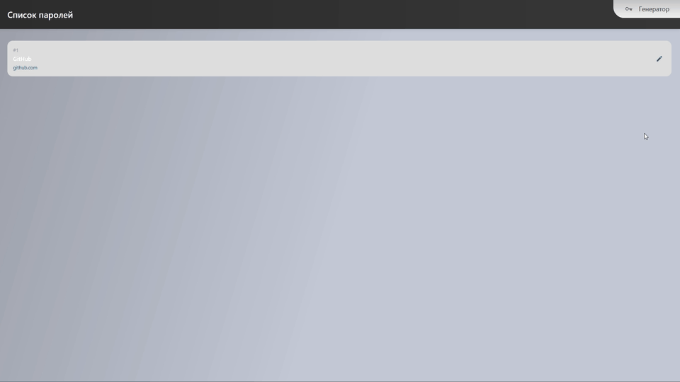

# Менеджер паролей

Приложение позволяет управлять своими паролями и создавать новые.

---

## 1. Генератор паролей

Позволяет создавать безопасные пароли с настройкой сложности.  
Можно включать или выключать следующие опции:
1. **a-z** — нижний регистр  
2. **A-Z** — верхний регистр  
3. **0-9** — цифры  
4. **Специальные символы**  

Также можно задать длину пароля.  
Готовый пароль можно сразу:

- скопировать в буфер обмена  
- сохранить в приложении  

---

## 2. Список паролей

Здесь хранятся все сохранённые пароли.  

Особенности:  
1. Просмотр пароля  
2. Переход по URL, указанной при сохранении  
3. Изменение данных: название, пароль и URL  
4. Удаление пароля  

---

## 3. Использование оффлайн

Приложение реализовано как PWA и может использоваться без подключения к интернету.

---
[GitHub Pages](https://tallman653.github.io/Task2.PWA_password_manager-tallman/)
---

## Примеры действий

### 1. Сохранение пароля

### 2. Переход по ссылке

### 3. Удаление пароля

